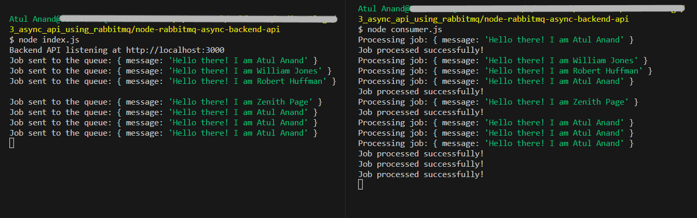

# Asynchronous Backend API with RabbitMQ

This repository contains the code for the demonstration of implementing an asynchronous backend API with Node.js and RabbitMQ. 

The blog post associated with this repository explains how to use RabbitMQ as a message queue to handle long-running jobs in a backend API.

[Medium Blog](https://ibatulanand.medium.com/enhancing-api-responsiveness-leveraging-rabbitmq-to-introduce-asynchronous-processing-in-node-js-23a522ace93d)

Author: [Atul Anand](https://www.linkedin.com/in/ibatulanand/)


# Requirements
Before running the application, ensure you have the following installed on your system:

* Node.js: The backend is developed using Node.js. You can download it from the official website (https://nodejs.org) and install it on your system.

* RabbitMQ: RabbitMQ is an open-source message-broker software. Download and install it from the official website (https://www.rabbitmq.com/download.html) following the installation instructions for your operating system.


# Getting Started

To run the application, follow these steps:

1. Clone the repository to your local machine:
   ```
   git clone https://github.com/ibatulanandjp/node-rabbitmq-async-backend-api.git
   cd node-rabbitmq-async-backend-api
   ```

2. Install the dependencies using npm:
   ```
   npm install
   ```

3. Start the RabbitMQ server (Make sure it is running before proceeding):
   ```
   rabbitmq-server
   ```

4. Start the worker to process the tasks:
   ```
   node worker.js
   ```

5. Start the backend API:
   ```
   node index.js
   ```
   The backend API will be available at http://localhost:3000.

6. Enqueue a long-running task:
   ```
   curl --location '127.0.0.1:3000/process-job' \
    --header 'Content-Type: application/json' \
    --data '{"message": "Hello there! I am Atul Anand"}'
   ```

7. Observe the output:
   


# License
This project is licensed under the MIT License.

Feel free to use, modify, and distribute this code as per the terms of the MIT License.

For a detailed explanation of how the backend API and RabbitMQ message queue work together, please refer to the technical blog associated with this repository.

Happy coding!